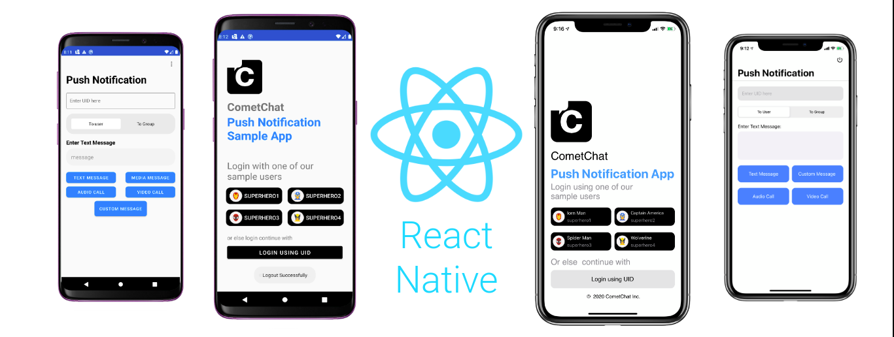

# Token-based Push Notifications Sample App

This Sample app will guide you to setup Push Notifications in your React Native application.

## Pre-requisite
1. Login to the <a href="https://app.cometchat.io/" target="_blank">CometChat Dashboard</a>.
2. Select an existing app or create a new one.
3. Go to "API & Auth Keys" section and copy the `REST API` key from the "REST API Keys" tab.
4. Go to the "Extensions" section and Enable the Push Notifications extension.
5. Go to the "Installed" tab in the same section and open the settings for this extension and Set the version to `V2`.
6. Paste the `REST API Key` in the Settings.
7. Go to <a href="https://console.firebase.google.com/" target="_blank">Firebase Console</a> and get the Server Key for your app. Paste the Server Key in the settings and click on save.
7. Copy your app's `APP_ID`, `REGION` and `AUTH_KEY` from the Dashboard. These will be required in the next steps.

## Usage

1. Clone this repository.
2. Navigate to the `src/Resources` directory and replace `APP_ID`, `REGION` and `AUTH_KEY` with yours in `Constants.js` file.
3. Go to <a href="https://console.firebase.google.com/" target="_blank">Firebase Console</a> and get your `google-services.json` and `GoogleService-Info.plist`.
4. Place the `google-services.json` in android/app folder.
5. For iOS `GoogleService-Info.plist` check the documentation <a href="https://rnfirebase.io/#3-ios-setup" target="_blank">here</a>.
5. Run `npm install` in the project's root directory to install the dependencies.
6. For Android execute `react-native run-android`
7. For iOS execute `react-native run-ios`

---

## Documentation

<a href="https://prodocs.cometchat.com/docs/extensions-enhanced-push-notification" target="_blank">Token-based Push Notifications</a>