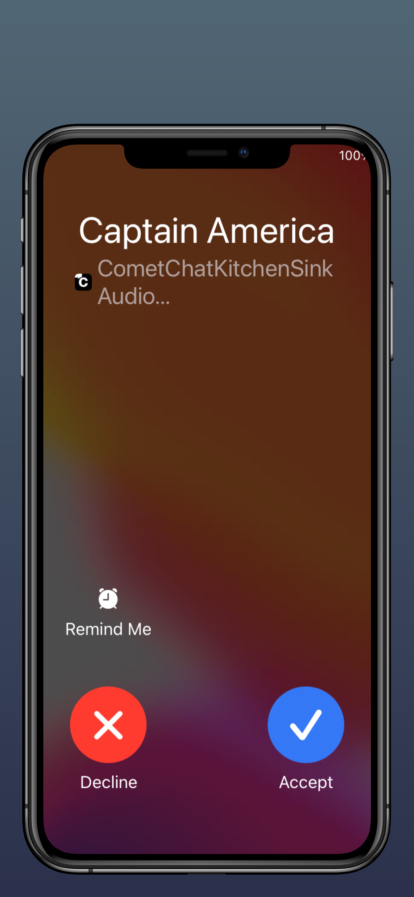
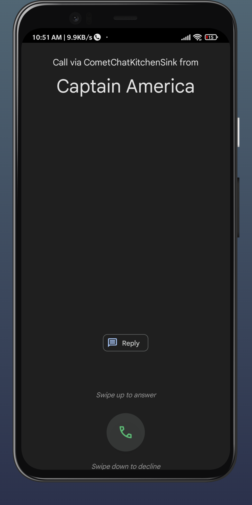
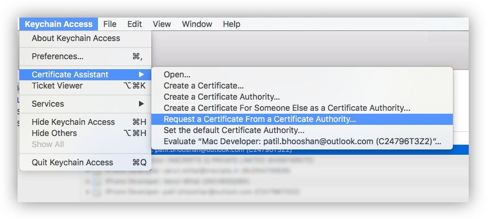
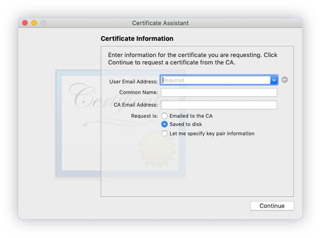
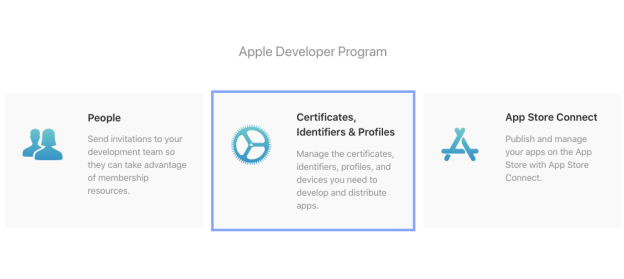
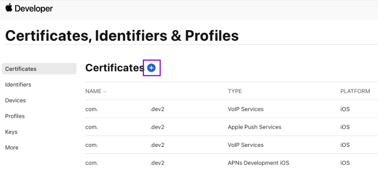
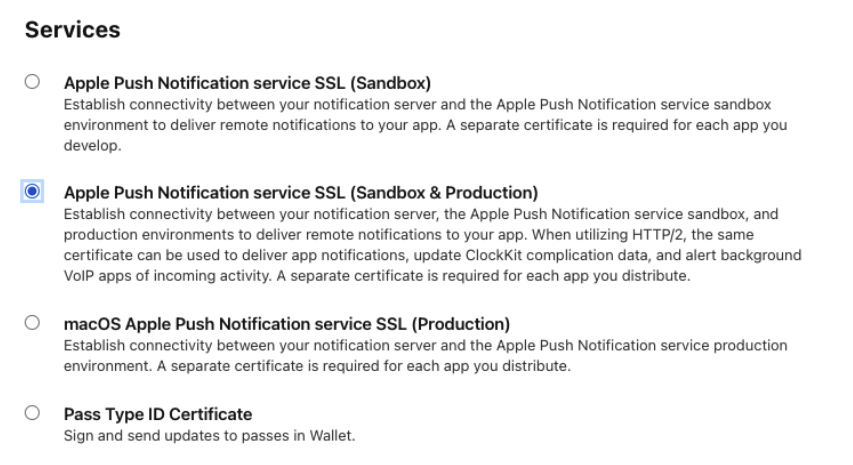
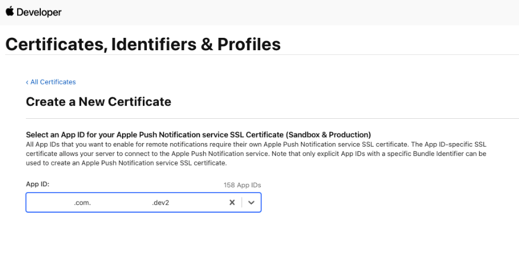
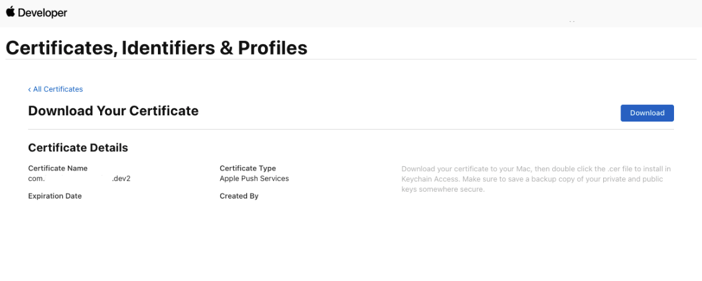
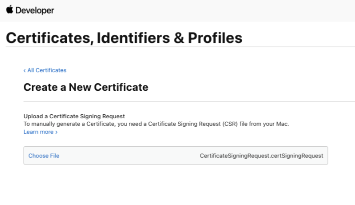

# Integrating ConnectionService and CallKit Using CometChat Push Notification

<table style="border: none;">
 <tr>
    <th>IOS</th>
    <th>ANDROID</th>
  </tr>
  <tr>
    <td valign="center"> </td>
    <td  valign="center"> </td>
  </tr>
</table>

## Setup push notification

### Android

Kindly follow the instruction for setting Firebase Cloud Messaging explained [here](https://www.cometchat.com/docs/v3/extensions/react-native-push-notifications)

### IOS

For ios we use Apple Push Notification service or APNs to send push notification and voip notification
To configure this we need to follow some additional steps

### Step 1: Create a Certificate Signing Request

To obtain a signing certificate required to sign apps for installation on iOS devices, you should first create a certificate signing request (CSR) file through Keychain Access on your Mac.

1. Open the Keychain Access from the utility folder, go to Keychain Access &gt; Certificate Assistant &gt; Request a Certificate From a Certificate Authority, and then click.

    <br></br>

2. The Certificate Information dialog box appears. Enter the email address that you use in your Apple Developer account, and enter a common name for your private key. Don't enter CA email address, choose Saved to disk, and then click the Continue button.
    <br></br>

3. Specify the name of your CSR to save and choose the location to save the file on your local disk. Then your CSR file is created, which contains a public/private key pair.

### Step 2: Create an SSL certificate

1. Sign in to your account at the [Apple Developer Member Center](https://developer.apple.com/membercenter).
2. Go to Certificates, Identifiers & Profiles.

 <br></br>

3. Create new Certificate by clicking on the + icon.

 <br></br>

4. Under Services, select - Apple Push Notification services SSL (Sandbox & Production)

 <br></br>

5. Select your App ID from the dropdown.

 <br></br>

6. Upload CSR file., upload the CSR file you created through the **Choose File** button. To complete the process, choose Continue. When the certificate is ready, choose Download to save it to your Mac.

 <br></br>
<br></br>
 <br></br>

### Step 3: Export and update .p8 certificate

1. To generate a .p8 key file, go to [Apple developer account page](https://developer.apple.com/account/), then select Certificates, IDs & Profiles.
2. Select Keys and click on the "+" button to add a new key.
3. In the new key page, type in your key name and check the Apple Push Notification service (APNs) box, then click "Continue" and click "Register".
4. Then proceed to download the key file by clicking Download.
5. Make note of the `Key ID`, `Team ID` and your `Bundle ID` for saving in the Extension's settings.

**If you wish to use the .p12 certificate instead, do the following:**

1. Type a name for the .p12 file and save it to your Mac.
2. Browse to the location where you saved your key, select it, and click Open. Add the key ID for the key (available in Certificates, Identifiers & Profiles in the Apple Developer Member Center) and export it.
3. DO NOT provide an export password when prompted.
4. The .p12 file will be required in the next step for uploading in the CometChat Pro Dashboard.

### Extension settings

### Step 1: Enable the extension

1. Login to CometChat and select your app.
2. Go to the Extensions section and Enable the Push Notifications extension.
3. Open the settings for this extension and save the following.

### Step 2: Save your settings

On the Settings page you need to enter the following:

 <br></br>

1. Set extension version

   1. The extension version has to be set to 'V2' or 'V1 & V2' in order to use APNs as the provider.

2. Select Platforms

   1. You can select the platforms on which you wish to receive Push Notifications.

3. Firebase Cloud Messaging Settings

   1. This includes the FCM Server key that you can fetch from the Firebase Dashboard.

4. APNs Settings

   1. You can turn off the Production mode when you create a development build of your application.

   2. Upload the .p12 certificate exported in the previous step.

5. Push Notifications Title

   1. This is usually the name of your app.

6. Notification Triggers

   1. Select the triggers for sending Push Notifications. These triggers can be classified into 3 main categories:

      1. Message Notifications
      2. Call Notifications
      3. Group Notifications

   2. These are pretty self-explanatory and you can toggle them as per your requirement.

## Installation

We need to add two packages for this

- React-native-CallKeep

  This package also require some additional installation steps. Follow [this](https://github.com/react-native-webrtc/react-native-callkeep) link to install react-native-callkeep

  ```
  npm install --save react-native-callkeep
  or
  yarn add react-native-callkeep
  ```

- React Native VoIP Push Notification

  This package also require some additional installation steps. Follow [this](https://github.com/react-native-webrtc/react-native-voip-push-notification#readme) link to install react-native-voip-push-notification.

  ```
  npm install --save react-native-voip-push-notification
   # --- if using pod
  cd ios/ && pod install
  ```

## App Setup

First you need to Setup CallKeep at the start of the app in Index.js

```javascript
const options = {
  ios: {
    appName: 'My app name',
  },
  android: {
    alertTitle: 'Permissions required',
    alertDescription: 'This application needs to access your phone accounts',
    cancelButton: 'Cancel',
    okButton: 'ok',
    imageName: 'phone_account_icon',

    foregroundService: {
      channelId: 'com.company.my',
      channelName: 'Foreground service for my app',
      notificationTitle: 'My app is running on background',
      notificationIcon: 'Path to the resource icon of the notification',
    },
  },
};
RNCallKeep.setup(options);
RNCallKeep.setAvailable(true);
let callKeep = new CallKeepHelper();
```

In order to handle connectionService and CallKit we have made a helper call.

```javascript
import {CometChat} from '@cometchat-pro/react-native-chat';
import {Platform} from 'react-native';
import uuid from 'react-native-uuid';
import RNCallKeep, {AnswerCallPayload} from 'react-native-callkeep';
import {navigate} from '../StackNavigator';
import messaging from '@react-native-firebase/messaging';
import VoipPushNotification from 'react-native-voip-push-notification';
import invokeApp from 'react-native-invoke-app';
import KeepAwake from 'react-native-keep-awake';
import {AppState} from 'react-native';
import _BackgroundTimer from 'react-native-background-timer';
export default class CallKeepHelper {
  constructor(msg) {
    if (msg) {
      CallKeepHelper.msg = msg;
    }
    this.setupEventListeners();
    this.registerToken();
    this.checkLoggedInUser();
    this.addLoginListener();
    CallKeepHelper.callEndedBySelf = false;
  }
  static FCMToken = null;
  static voipToken = null;
  static msg = null;
  static callEndedBySelf = null;
  static callerId = '';
  static callerId1 = '';
  static isLoggedIn = false;
  checkLoggedInUser = async () => {
    try {
      let user = await CometChat.getLoggedinUser();
      if (user) {
        if (user) {
          CallKeepHelper.isLoggedIn = true;
        }
      }
    } catch (error) {
      console.log('error checkLoggedInUser', error);
    }
  };

  addLoginListener = () => {
    var listenerID = 'UNIQUE_LISTENER_ID';
    CometChat.addLoginListener(
      listenerID,
      new CometChat.LoginListener({
        loginSuccess: (e) => {
          CallKeepHelper.isLoggedIn = true;
          this.registerTokenToCometChat();
        },
      }),
    );
  };

  registerTokenToCometChat = async () => {
    if (!CallKeepHelper.isLoggedIn) {
      return false;
    }

    try {
      if (Platform.OS == 'android') {
        if (CallKeepHelper.FCMToken) {
          let response = await CometChat.registerTokenForPushNotification(
            CallKeepHelper.FCMToken,
          );
        }
      } else {
        if (CallKeepHelper.FCMToken) {
          let response = await CometChat.registerTokenForPushNotification(
            CallKeepHelper.FCMToken,
            {voip: false},
          );
        }
        if (CallKeepHelper.voipToken) {
          let response = await CometChat.registerTokenForPushNotification(
            CallKeepHelper.voipToken,
            {voip: true},
          );
        }
      }
    } catch (error) {}
  };

  registerToken = async () => {
    try {
      const authStatus = await messaging().requestPermission();
      const enabled =
        authStatus === messaging.AuthorizationStatus.AUTHORIZED ||
        authStatus === messaging.AuthorizationStatus.PROVISIONAL;
      if (enabled) {
        if (Platform.OS == 'android') {
          let FCM = await messaging().getToken();

          CallKeepHelper.FCMToken = FCM;
          this.registerTokenToCometChat();
        } else {
          VoipPushNotification.registerVoipToken();
          let FCM = await messaging().getAPNSToken();
          CallKeepHelper.FCMToken = FCM;
          this.registerTokenToCometChat();
        }
      }
    } catch (error) {}
  };

  endCall = ({callUUID}) => {
    if (CallKeepHelper.callerId) RNCallKeep.endCall(CallKeepHelper.callerId);
    _BackgroundTimer.start();
    setTimeout(() => {
      this.rejectCall();
    }, 3000);
  };

  rejectCall = async () => {
    if (
      !CallKeepHelper.callEndedBySelf &&
      CallKeepHelper.msg &&
      CallKeepHelper.msg.call?.category !== 'custom'
    ) {
      var sessionID = CallKeepHelper.msg.sessionId;
      var status = CometChat.CALL_STATUS.REJECTED;
      let call = await CometChat.rejectCall(sessionID, status);
      _BackgroundTimer.stop();
    } else {
      _BackgroundTimer.stop();
    }
  };

  static displayCallAndroid = () => {
    this.IsRinging = true;
    CallKeepHelper.callerId = CallKeepHelper.msg.conversationId;
    RNCallKeep.displayIncomingCall(
      CallKeepHelper.msg.conversationId,
      CallKeepHelper.msg.sender.name,
      CallKeepHelper.msg.sender.name,
      'generic',
    );
    setTimeout(() => {
      if (this.IsRinging) {
        this.IsRinging = false;
        RNCallKeep.reportEndCallWithUUID(CallKeepHelper.callerId, 6);
      }
    }, 15000);
  };

  // NOTE: YOU MIGHT HAVE TO MAKE SOME CHANGES OVER HERE AS YOU AS YOUR IMPLEMENTATION OF REACT-NATIVE-UI-KIT MIGHT BE DIFFERENT. YOU JUST NEED TO CALL THE ACCEPT CALL METHOD AND NAVIGATE TO CALL SCREEN.
  answerCall = ({callUUID}) => {
    this.IsRinging = false;
    CallKeepHelper.callEndedBySelf = true;
    setTimeout(
      () =>
        navigate({
          index: 0,
          routes: [{name: 'Conversation', params: {call: CallKeepHelper.msg}}],
        }),
      2000,
    );
    // RNCallKeep.endAllCalls();
    RNCallKeep.backToForeground();
    if (Platform.OS == 'ios') {
      if (AppState.currentState == 'active') {
        RNCallKeep.endAllCalls();
        _BackgroundTimer.stop();
      } else {
        this.addAppStateListener();
      }
    } else {
      RNCallKeep.endAllCalls();
      _BackgroundTimer.stop();
    }
  };

  addAppStateListener = () => {
    AppState.addEventListener('change', (newState) => {
      if (newState == 'active') {
        RNCallKeep.endAllCalls();
        _BackgroundTimer.stop();
      }
    });
  };

  didDisplayIncomingCall = (DidDisplayIncomingCallArgs) => {
    if (DidDisplayIncomingCallArgs.callUUID) {
      if (Platform.OS == 'ios') {
        CallKeepHelper.callerId = DidDisplayIncomingCallArgs.callUUID;
      }
    }
    if (DidDisplayIncomingCallArgs.error) {
      console.log({
        message: `Callkeep didDisplayIncomingCall error: ${DidDisplayIncomingCallArgs.error}`,
      });
    }

    this.IsRinging = true;

    setTimeout(() => {
      if (this.IsRinging) {
        this.IsRinging = false;
        // 6 = MissedCall
        // https://github.com/react-native-webrtc/react-native-callkeep#constants
        RNCallKeep.reportEndCallWithUUID(
          DidDisplayIncomingCallArgs.callUUID,
          6,
        );
      }
    }, 15000);
  };

  setupEventListeners() {
    if (Platform.OS == 'ios') {
      CometChat.addCallListener(
        'this.callListenerId',
        new CometChat.CallListener({
          onIncomingCallCancelled: (call) => {
            RNCallKeep.endAllCalls();
          },
        }),
      );

      RNCallKeep.addEventListener('didLoadWithEvents', (event) => {
        for (let i = 0; i < event.length; i++) {
          if (event[i]?.name == 'RNCallKeepDidDisplayIncomingCall') {
            CallKeepHelper.callerId = event[i]?.data?.callUUID;
          }
        }
      });

      VoipPushNotification.addEventListener('register', async (token) => {
        CallKeepHelper.voipToken = token;
        this.registerTokenToCometChat();
      });
      VoipPushNotification.addEventListener('notification', (notification) => {
        let msg = CometChat.CometChatHelper.processMessage(
          notification.message,
        );

        CallKeepHelper.msg = msg;
      });

      VoipPushNotification.addEventListener(
        'didLoadWithEvents',
        async (events) => {
          if (!events || !Array.isArray(events) || events.length < 1) {
            return;
          }
          for (let voipPushEvent of events) {
            let {name, data} = voipPushEvent;
            if (
              name ===
              VoipPushNotification.RNVoipPushRemoteNotificationsRegisteredEvent
            ) {
              CallKeepHelper.voipToken = data;
            } else if (
              name ===
              VoipPushNotification.RNVoipPushRemoteNotificationReceivedEvent
            ) {
              let msg = CometChat.CometChatHelper.processMessage(data.message);

              CallKeepHelper.msg = msg;
            }
          }
        },
      );
    }

    RNCallKeep.addEventListener('endCall', this.endCall);

    RNCallKeep.addEventListener('answerCall', this.answerCall);
  }

  removeEventListeners() {
    RNCallKeep.removeEventListener('endCall');
    RNCallKeep.removeEventListener('didDisplayIncomingCall');
    RNCallKeep.removeEventListener('didLoadWithEvents');
    VoipPushNotification.removeEventListener('didLoadWithEvents');
    VoipPushNotification.removeEventListener('register');
    VoipPushNotification.removeEventListener('notification');
  }
}
```

### Android

In android we are going to use Firebase push notification to display Call notification So basically when ever we receive a push notification for call we display call notification.

we need to add a listener to listen to notification when the app is background or foreground state.

```javascript
messaging().setBackgroundMessageHandler(async (remoteMessage) => {
  RNCallKeep.setup(options);
  RNCallKeep.setAvailable(true);

  try {
    //Converting the message payload into CometChat Message.
    let msg = CometChat.CometChatHelper.processMessage(
      JSON.parse(remoteMessage.data.message),
    );
    if (msg.category == 'call') {
      //need to check if the notification we received for Call initiated or ended
      if (msg.action == 'initiated') {
        CallKeepHelper.msg = msg; //setting the msg object in call keep helper class
        CallKeepHelper.displayCallAndroid(); //this method is used to display incoming calls in android t
      } else {
        //if sender cancels the call before receiver accept or reject call then we also need to stop our notification
        RNCallKeep.endCall(msg.conversationId);
      }
    }
  } catch (e) {
    console.log(e);
  }
});
```

### IOS

In IOS we use APNs push and voip push notification to display push notification and display call CallKit for calls.
The notification are handled in Native IOS
You need to add the code in AppDelegate.m file to display CallKit

```objc
//add this import at the top or the file
#import "RNCallKeep.h"
#import "RNFBMessagingModule.h"
#import <PushKit/PushKit.h>
#import "RNVoipPushNotificationManager.h"


/* <------ add this function */
- (void)pushRegistry:(PKPushRegistry *)registry didUpdatePushCredentials:(PKPushCredentials *)credentials forType:(PKPushType)type {
  // Register VoIP push token (a property of PKPushCredentials) with server

  [RNVoipPushNotificationManager didUpdatePushCredentials:credentials forType:(NSString *)type];
}

- (void)pushRegistry:(PKPushRegistry *)registry didInvalidatePushTokenForType:(PKPushType)type
{
  // --- The system calls this method when a previously provided push token is no longer valid for use. No action is necessary on your part to re-register the push type. Instead, use this method to notify your server not to send push notifications using the matching push token.
}

// --- Handle incoming pushes
- (void)pushRegistry:(PKPushRegistry *)registry didReceiveIncomingPushWithPayload:(PKPushPayload *)payload forType:(PKPushType)type withCompletionHandler:(void (^)(void))completion {

  // --- NOTE: apple forced us to invoke callkit ASAP when we receive voip push
  // --- see: react-native-callkeep

  // --- Retrieve information from your voip push payload
  NSDictionary *content = [payload.dictionaryPayload valueForKey:@"aps"];
  NSDictionary *sender = [content valueForKey:@"alert"];
  NSString *uuid =[[[NSUUID UUID] UUIDString] lowercaseString];
  NSString *callerName=[sender valueForKey:@"title"];
  NSString *handle = [sender valueForKey:@"title"];

  // --- Process the received push
   [RNVoipPushNotificationManager didReceiveIncomingPushWithPayload:payload forType:(NSString *)type];

  [RNCallKeep reportNewIncomingCall: uuid
                               handle: handle
                           handleType: @"generic"
                             hasVideo: NO
                  localizedCallerName: callerName
                      supportsHolding: YES
                         supportsDTMF: YES
                     supportsGrouping: YES
                   supportsUngrouping: YES
                          fromPushKit: YES
                              payload: nil
                withCompletionHandler: completion];

}
```

---

For more information, you can visit our [documentation](https://app.developerhub.io/cometchat-documentation/v3/extensions/react-native-push-notifications).

**NOTE**

- Currently we can only handle default calling notification
- Whenever the user answer the call we use RNCallKeep.backToForeground(); method to bring the app in to foreground but in some devices you might need to add few more permissions for this to work
  For example, In MIUI 11 you need to permission for Display pop-up windows while running in the background
- When the IOS app is in lock state we are not able to open the app so the call start on callkeep it self and you can hear the audio but if you want a video call then the user has to unlock the phone click on the app icon on call screen.
- If you want to use the callkit and connection service in foreground then you might consider turning the callNotifications settings in UI kit settings. For more information in UI kit settings check the [documentation](https://www.cometchat.com/docs/react-native-chat-ui-kit/customize-ui-kit).

---
